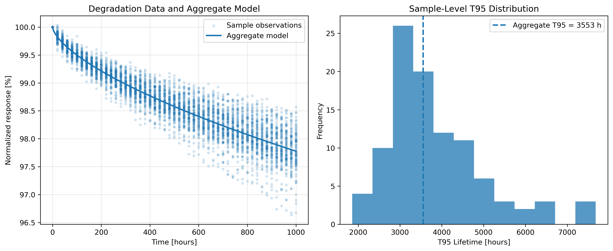

# Reliability Lifetime Prediction from Degradation Time-Series Data

A synthetic case study using nonlinear degradation modeling to estimate product lifetime, quantify sample-to-sample variability, and evaluate model performance.

## Overview

Long-duration reliability testing can require substantial time before a product reaches a meaningful degradation threshold. This project explores whether degradation time-series measurements can be modeled to estimate long-term lifetime and quantify variability across samples.

The workflow fits a stretched-exponential degradation model to fully synthetic time-series data, estimates sample-level lifetime, evaluates goodness of fit, identifies potential outliers, and generates an aggregate population-level lifetime estimate.

## Problem

Suppose a reliability test tracks a normalized performance metric over time for multiple samples.

Instead of relying only on the final observed degradation point, statistical modeling can be used to answer questions such as:

- Can observed degradation trajectories be used to estimate long-term lifetime?
- How much does estimated lifetime vary across samples?
- Which samples behave unusually relative to the population?
- How well does the selected degradation model represent the observed data?

In this project, lifetime is represented by **T95**, defined as the estimated time at which the normalized response reaches 95% of its initial value.

## Dataset

The project uses a fully synthetic degradation dataset containing:

- 100 independent samples
- Measurements from 0 to 1,000 hours
- 51 time points per sample
- Sample-to-sample parameter variation
- Random measurement noise

The dataset is generated programmatically so that no proprietary or employer data is used.

## Methodology

### 1. Synthetic Data Generation

Each sample is generated using a stretched-exponential degradation curve with randomly varied parameters and small measurement noise.

This creates realistic sample-to-sample variability while keeping the dataset fully synthetic and reproducible.

### 2. Data Preprocessing

For each sample, the workflow:

- Converts observations to numeric values
- Removes invalid values
- Sorts observations by time
- Normalizes measurements relative to the baseline value at time zero

### 3. Stretched-Exponential Modeling

Each degradation trajectory is modeled as:

\[
y(t) = \exp(-a t^b)
\]

where:

- `a` represents the degradation-rate parameter
- `b` represents the curve-shape parameter
- `t` represents elapsed time

The parameters are estimated using nonlinear least-squares optimization with `scipy.optimize.curve_fit`.

### 4. Lifetime Estimation

T95 is defined as the time when the modeled normalized response reaches 0.95.

For each sample, the fitted parameters are used to calculate an estimated T95 lifetime.

### 5. Model Evaluation

For every sample, the analysis calculates:

- Fitted parameters `a` and `b`
- T95 lifetime estimate
- R² goodness-of-fit
- Predicted degradation trajectory

The workflow therefore evaluates model quality before interpreting lifetime predictions.

### 6. Population-Level Analysis

Sample-level lifetime estimates are summarized using:

- Mean T95
- Standard deviation
- Coefficient of variation
- T95 distribution
- Mean model R²

A simple three-standard-deviation rule is also used to flag potential sample-level outliers for further inspection.

In addition, all normalized observations are pooled to fit an aggregate degradation model representing the overall population trend.

## Results

The analysis successfully fitted all 100 synthetic samples.

### Sample-Level Results

- Mean T95: **3,816.84 hours**
- Standard deviation of T95: **1,161.72 hours**
- Coefficient of variation: **30.44%**
- Mean R²: **0.98**
- Valid lifetime estimates: **100 / 100**
- Potential outliers identified: **2**

The high average R² indicates that the stretched-exponential model captures the synthetic degradation trajectories well.

At the same time, the distribution of T95 estimates demonstrates meaningful sample-to-sample lifetime variability.

### Aggregate Model

Pooling normalized observations across all samples produced an aggregate model with an estimated:

**Aggregate T95 ≈ 3,553 hours**

The aggregate estimate differs from the mean of individual sample-level estimates because the two approaches summarize the population differently.

## Visualization



The left panel shows individual degradation observations together with the fitted aggregate degradation curve.

The right panel shows the distribution of sample-level T95 estimates and the aggregate lifetime estimate.

## Project Structure

```text
reliability-lifetime-prediction/
│
├── README.md
├── .gitignore
│
├── data/
│   ├── synthetic_degradation.csv
│   └── lifetime_results.csv
│
├── figures/
│   └── lifetime_summary.png
│
├── notebooks/
│
└── src/
    ├── data_generator.py
    ├── lifetime_model.py
    ├── analysis.py
    └── visualization.py
```

## Tech Stack

- Python
- pandas
- NumPy
- SciPy
- scikit-learn
- Matplotlib

## Key Takeaways

This project demonstrates an end-to-end reliability modeling workflow that combines:

- Synthetic data generation
- Nonlinear model fitting
- Lifetime extrapolation
- Model validation
- Variability analysis
- Outlier screening
- Automated visualization

Rather than reporting only a single prediction, the workflow evaluates both model fit and variability across individual samples.

## Future Improvements

Potential extensions include:

- Bootstrap confidence intervals for lifetime estimates
- Residual-based model diagnostics
- Comparison with alternative degradation models
- More robust outlier detection methods
- Prediction using partial observation windows
- Quantification of extrapolation uncertainty
- Interactive analysis using Streamlit

## Disclaimer

This project was independently developed for educational and portfolio purposes using fully synthetic data.

It demonstrates general statistical modeling concepts for degradation and reliability analysis and does not contain or reproduce any proprietary data, source code, product specifications, test conditions, internal methodologies, or confidential information from any current or former employer.
